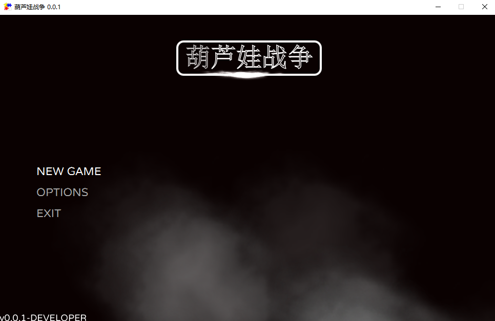
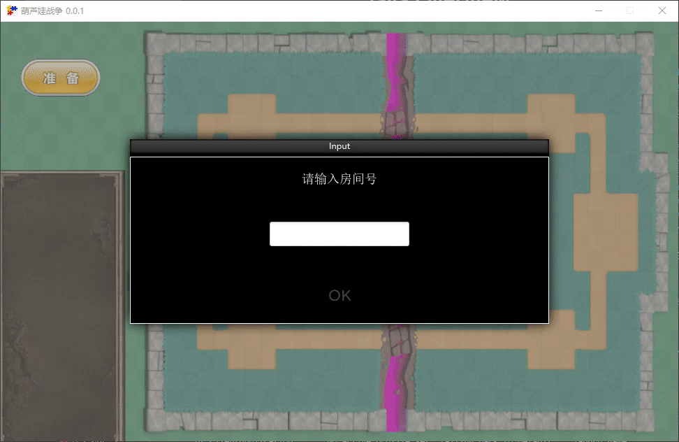
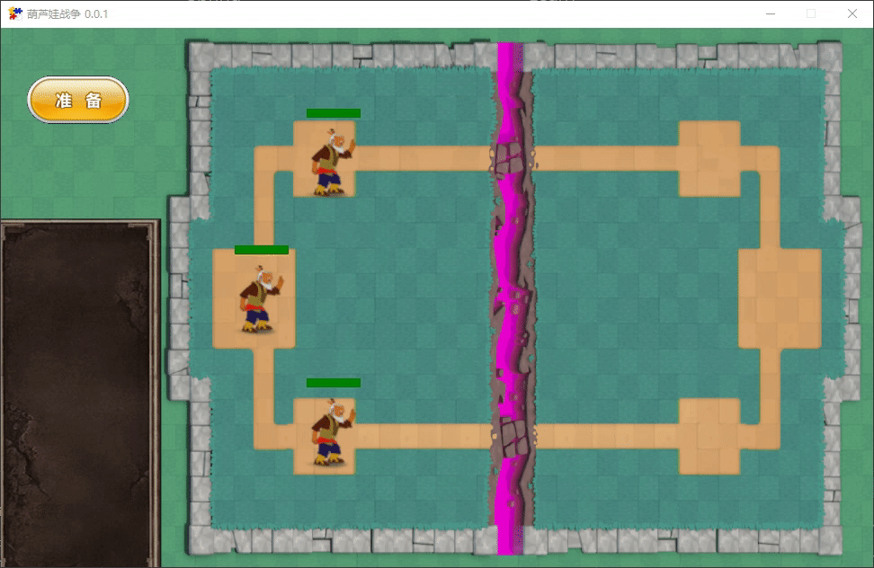
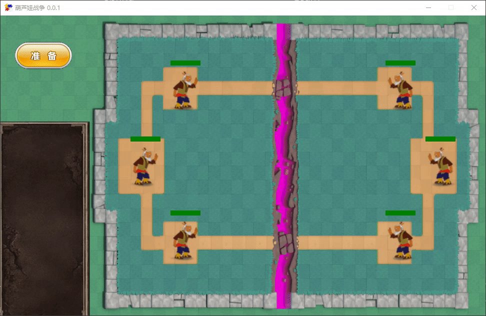
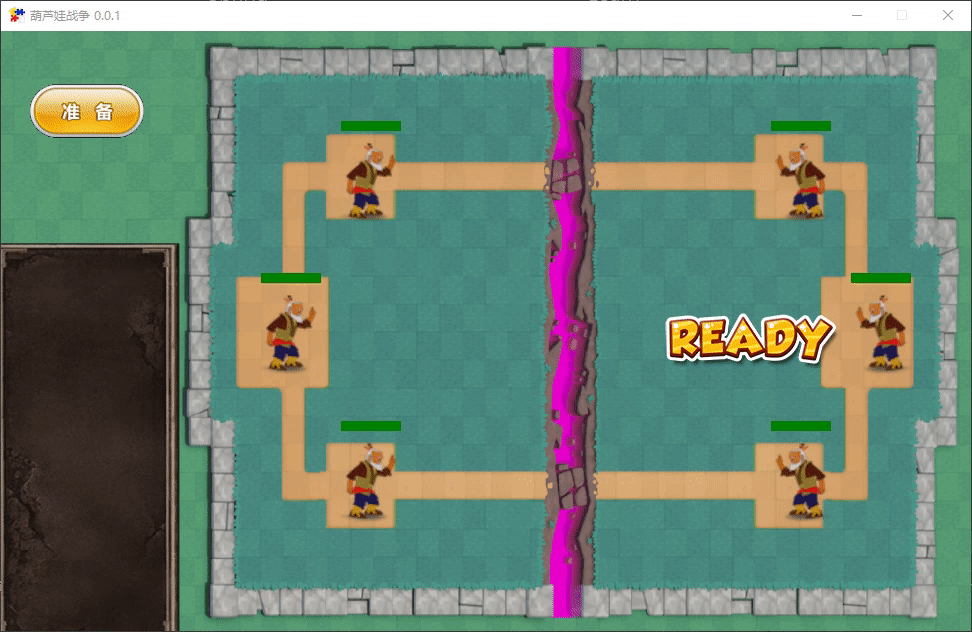
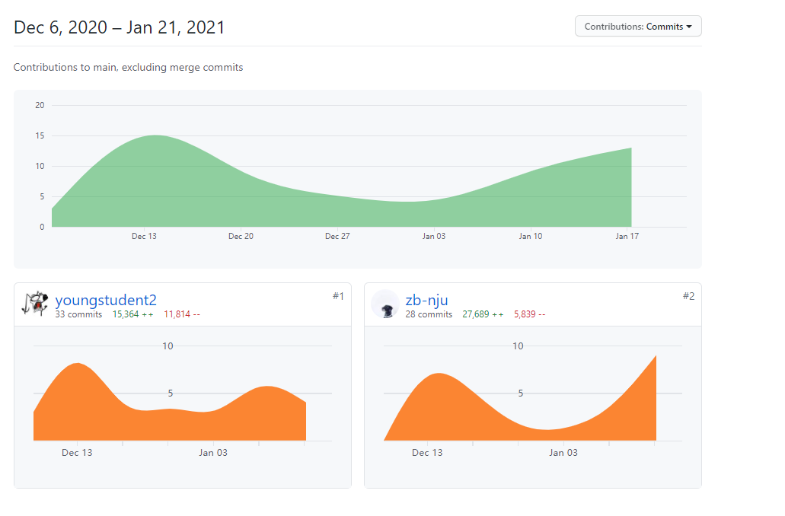

# HuluCR

181860106 王梓博 @ 181860055 刘国涛


## 1.设计思路

本次大实验是参照今年火热的游戏[皇室战争](https://baike.baidu.com/item/%E9%83%A8%E8%90%BD%E5%86%B2%E7%AA%81%EF%BC%9A%E7%9A%87%E5%AE%A4%E6%88%98%E4%BA%89/19272002)进行设计的一个卡牌 MOBA 游戏，在按时增长的圣水的限制下，玩家可以从卡牌槽中选择卡牌角色，不同角色具有不同的攻击方式、攻击范围、攻击速度、移动速度、血量等等。战场以河为分界，玩家可以按照一定的策略将角色放置在战场上己方的任意位置，以实现拉扯、强攻等，并以先摧毁对方三座塔（在本游戏中为三个爷爷）的一方作为胜利的一方。


## 2.操作说明

* 运行方法：

  首先需要运行服务器，入口为：HuluCR.server.src.main.java.nju.java315.server.ServerApplication。

  服务器运行成功之后，通过入口 HuluCR.client.src.main.java.nju.java315.client.ClientApplication 启动两个客户端。

  为了检查方便，我们编写了运行脚本，只需**在项目根目录执行 build 指令**，即可生成一个服务器和两个客户端。

* 游戏开始界面如下：



* 进入房间

  点击 NEW GAME，会显示一个输入框，输入一个自定义的房间号即可进入/创建指定房间号的房间。




* 对手进入房间

  进入房间之后，己方的三个塔（爷爷）会立即生成，头上为其血条。若房间里原本已经有人，则对手的三个塔也生成；否则，当有对手输入相同房间号，进入该房间时，其塔才会生成，作为房间里是否有对手的一个标志。




* 准备

  为了缓冲，我们设置了准备阶段，当一方准备时，两个客户端会显示准备标志

  


* 游戏开始

  当双方均准备之后，会有一段动画提示游戏开始，此时卡槽里的卡片会出现，圣水条、计时器也会同时出现。

  


* 放置角色

  每位玩家初始时有 7 点圣水，每两秒会增加一滴圣水，放置每个角色消耗两点圣水，当圣水用完时，玩家必须等待圣水增长。利用鼠标将卡片拖到己方战场的任意位置并放置即可实现角色的放置。由于引入了范围检测，玩家无法在己方战场之外的任何位置放置角色。放置的角色具有不同的感应范围，并会自动对感应范围内的对手进行攻击。

  

  


## 3.游戏设计

### 项目框架：

* 利用 Spring Boot 搭建应用初始框架，利用 maven 做项目包管理；
* 利用 GitHub 上对 JavaFX 进行延伸扩展的开源项目 [FXGL](https://github.com/AlmasB/FXGL) 实现客户端图形界面；
* 利用 Google 公司的开源项目 [netty](https://github.com/netty/netty) 实现服务器端的信息接收、处理和发送；
* 利用 Google 公司的开源项目 [protobuf](https://github.com/protocolbuffers/protobuf)，并结合自身需求，设计实现客户端与服务器的通信协议。


### 具体实现：

#### 客户端：

客户端中需要负责的任务较多，大致可以分为以下几类：

* 实体的生成
* 网络信息的发送、接收和处理

* 用户鼠标事件的处理
* 游戏运行逻辑的运算和处理

* 图形界面的绘制和刷新

根据 FXGL 框架的要求，我们需要编写一个 GameApplication 的子类 HuluCRApp，在其中实现游戏的上述功能。由于项目代码较多，因此我们通过聚类，在 HuluCRApp 通过引用实现在其他类中的功能，完成上述的要求。下面分别从以上四个方面对项目的实现进行介绍。 


##### 1.生成实体：

我们采用了 ECS 架构，即Entity-Component-System（实体-组件-系统）的缩写，其模式遵循组合优于继承的原则。

**游戏内的每个基本单元都是一个实体**，需要先实现自定义的工厂类 HuluCRFactory，其为 FXGL 中 EntityFactory 类的子类。在该类中，需要为每个生成函数附上标注 **@Spawn("SomeEntity")** 来指定该生成函数是用于生成 SomeEntity 的。实现该函数之后，便可以在代码中需要生成角色的地方使用 **spawn("SomeEntity")** 语句来生成角色。

~~~java
public class HuluCRFactory implements EntityFactory {

    @Spawns("LargeHulu")
    public Entity newLargeHulu(SpawnData data) {
        boolean flag = data.get("flag");
        Entity e = FXGL.entityBuilder()
            .type(MonsterType.LARGE_HULU)
            .viewWithBBox(MonsterType.LARGE_HULU.getRightUrl())
            .with(new HealthCompoent(MonsterType.LARGE_HULU.getHp()))
            .with(new CollidableComponent(true))
            .with(new FireBallAttack())
            .with(new IdentityComponent(flag))
            .with(new CellMoveComponent(Config.CELL_WIDTH, Config.CELL_HEIGHT, MonsterType.LARGE_HULU.getSpeed()))
            .with(new AStarMoveComponent(new LazyValue<>(() -> geto("grid"))))
            .with(new SensorComponent(MonsterType.LARGE_HULU.getSensor()))
            .with(new StateComponent())
            .with(new MovableMonsterAIComponent())
            .build();

       	 e.setPosition(data.getX() - e.getWidth()/2, data.getY() - e.getY() - e.getHeight()/2);
        return e;
    }
    ......
}
~~~

每个实体里面有多个**组件**， 每个**组件**仅包含代表其特征的数据，例如：移动相关的**组件**仅仅包含速度、位置等属性。

* 伤害组件

  `DamageComponent`继承自`IntegerComponent`，用于描述一种攻击方式的伤害数值，在碰撞检测中将被用于计算被攻击者剩余的血量

* 生命组件

  `HealthComponent`继承自`IntegerComponent`，用于表示一个`Monster`的血量。另外还会为其实体创建**血量条**，用于实时显示当前血量

* 身份组件

  `IdentityComponent`继承自`BooleanComponent`，用于表示一个`Monster`的身份，并重载了`onAdded`方法，在组件被加入时，根据怪物身份设置怪物的朝向

* 传感器组件

  `SensorComponent`用于怪物AI感知周围的敌方目标，并标记感知范围内最近的一个Monster为攻击对象

* AI

  * ### MonsterAIComponent

    AI组件的基类，要求具有状态组件和传感器组件，并会懒加载攻击方法

    ```java
    public class MonsterAICompenonet extends Component {
    
        protected StateComponent stateComponent;
        protected SensorComponent sensorComponent;
        protected AttackMethod attackMethod;
        protected String name;
    
        @Override
        public void onAdded() {
            bindAttackMethod();
        }
    
        protected void bindAttackMethod(){
            entity.getComponents().stream().filter(c -> c instanceof AttackMethod).findFirst().ifPresent(a -> {
                attackMethod = (AttackMethod) a;
            });
        }
    }
    ```

  * ### MovableMonsterComponent

    可移动AI组件，继承自`MonsterAIComponent`，实现了怪物的寻路、感知、攻击等行为

    需要实体具备AStarMoveComponent(A*寻路组件)、StateCmponent、SensorComponent

    ```java
    @Required(AStarMoveComponent.class)
    @Required(StateComponent.class)
    @Required(SensorComponent.class)
    ```

    定义了`WALK`和`ATTACK`两个状态，初始状态为`WALK`,通过AStarMoveComponent进行寻塔，在通过传感器感知到敌方单位时进行状态切换为`ATTACK`，并调用攻击方式向传感器感知到的目标发起攻击

  * ### UnmovableMonsterComponent

    不可移动AI组件，用于塔的AI，继承自`MonsterAIComponent`，实现了塔的感知、攻击等行为

    需要实体具备StateComponent和SensorComponent

    ```java
    @Required(StateComponent.class)
    @Required(SensorComponent.class)
    ```

    定义了`GUARD`和`ATTACK`两个状态，初始状态为`GUARD`，通过传感器感知到敌方单位时进行状态切换为`ATTACK`，并调用攻击方式向传感器感知到的目标发起攻击

* Attack

  * ### AttackMethod

    `AttackMethod`是所有攻击方法的基类，继承自`Component`，其派生类的实例将被作为组件加入到怪物实体中，定义了攻击方法相关的一些属性：

    ```java
    private String name;//名称
    protected int damage;//伤害
    protected int range;//攻击范围
    protected float attack_speed;//攻击速度
    ```

    并实现了根据攻击速度发起攻击的方法

    ```java
    private LocalTimer attackTimer = FXGL.newLocalTimer();
    public void attack(Entity target){
            if (entity.getComponent(HealthCompoent.class).isAlived() && attackTimer.elapsed(ATTACK_DELAY)) {
                spawnAttack(entity.getCenter(), target);
                attackTimer.capture();
            }
        }
    ```

    并为派生类提供了产生攻击实体的抽象方法：

    ```java
    protected abstract Entity spawnAttack(Point2D position, Entity target);
    ```

  * ### FireBallAttack

    火球攻击方式，继承自`AttackMethod`，重载了spawnAttack方法，通过工厂产生的`FireBall`实体

    ```java
    @Override
    protected Entity spawnAttack(Point2D position, Entity target) {
        return FXGL.spawn("Fireball", 
                          new SpawnData(position)
                          .put("dir", getDirection(target))
                          .put("target", target));
    }
    ```


由于攻击的火球、水球、矛等也是游戏世界中的一个实体，因此它们也用上述方式生成，通过附加属性来指定其方向、速度、伤害等。


##### 2.网络信息的发送、接收和处理

首先，需要实现[自定义的应用层通信协议](https://github.com/java315/HuluCR/blob/main/server/src/main/java/nju/java315/server/README.md)（位于利用 protobuf 生成的 GameMsgProtobuf.java 文件中）。由此生成的应用层数据包前2个字节为信息的类型，后续字节为信息。

网络信息的发送实现于类 SendMsgHandler 中，利用 FXGL 自带的用 TCP 协议实现的网络建立起与服务器的联系，实现各种接口，以供 HuluCRApp 中调用使用。在实现这些接口的过程中，需要先构造数据包，在利用定义的协议将数据转为字节数组，利用 FXGL 自带的将该字节数组发往服务器。

~~~java
class SendMsgHandler{
    private Client<byte[]> client;
    private Connection<byte[]> conn;
    ...
    public void enterRoom(int id){
        GameMsgProtocol.PlayerEntryCmd.Builder builder = GameMsgProtocol.PlayerEntryCmd.newBuilder();
        builder.setRoomID(id);
        GameMsgProtocol.PlayerEntryCmd cmd = builder.build();
        byte[] outputFrame = encode(cmd);
        if (conn != null)
            conn.send(outputFrame);
    }

    public void ready(){
        ...
    }

    public void putMonster(String monster,Point2D pos){
        ...
    }
    ...
        
    private byte[] encode(Object msg){
        try {
            int msgCode = -1;

            if(msg instanceof GameMsgProtocol.WhatRoomsCmd)
                msgCode = GameMsgProtocol.MsgCode.WHAT_ROOMS_CMD_VALUE;
            else if(msg instanceof GameMsgProtocol.PlayerEntryCmd)
                msgCode = GameMsgProtocol.MsgCode.PLAYER_ENTRY_CMD_VALUE;
            ......

            byte[] msgBody = ((GeneratedMessageV3)msg).toByteArray();

            byte[] bytes = new byte[2 + msgBody.length];
            bytes[0] = (byte) (msgCode >> 8 & 0xFF);
            bytes[1] = (byte) (msgCode & 0xFF);
            for(int i=0;i<msgBody.length;i++){
                bytes[i+2] = msgBody[i];
            }

            return bytes;
        } catch (Exception ex){
            LOGGER.error(ex.getMessage(), ex);
        }
        return null;
    }
}
~~~


网络信息的接受实现于类 ReceiveMsgHandler 中，利用上述提到的协议对收到的字节数组进行解码，再对解码得到的信息进行处理，触发相应的事件。对于事件的处理，我们采用了**观察者模式**后续在游戏初始化中将事件与对应的处理函数进行绑定，处理函数完成对信息的处理。

~~~java
public class ReceiveMsgHandler implements MessageHandler<byte[]> {
    @Override
    public void onReceive(Connection<byte[]> connection, byte[] msg) {
        GeneratedMessageV3 cmd = decodeMessage(msg);
        try {
            if (cmd instanceof GameMsgProtocol.WhatRoomsResult) {

            } else if (cmd instanceof GameMsgProtocol.PlayerEntryResult) {
                GameMsgProtocol.PlayerEntryResult result = (GameMsgProtocol.PlayerEntryResult) cmd;

                int entryPlayerID = result.getEntryPlayerID();
                if(entryPlayerID == geti("playerID")){
                    int roomID = result.getRoomID();
                    int enemyID = result.getEnemyID();
                    boolean enemyIsReady = result.getEnemyIsReady();
                    System.out.println(enemyIsReady);

                    getEventBus().fireEvent(new EntryResultEvent(EntryResultEvent.SELF_ENTRY_RESULT, roomID, enemyID, enemyIsReady));
                }
                else{
                    int enemyID = result.getEntryPlayerID();

                    getEventBus().fireEvent(new EntryResultEvent(EntryResultEvent.ENEMY_ENTRY_RESULT, enemyID));
                }
            } else if (cmd instanceof GameMsgProtocol.PlayerReadyResult) {
                ......
            } else if ......
    }
        
	......

    private GeneratedMessageV3 decodeMessage(byte[] msg) {
        if (msg == null)
            return null;

        try {

            ByteBuf byteBuf = Unpooled.wrappedBuffer(msg);

            // 消息的类型
            int msgCode = byteBuf.readShort();

            byte[] msgBody = new byte[byteBuf.readableBytes()];
            byteBuf.readBytes(msgBody);

            GeneratedMessageV3 cmd = null;

            switch (msgCode) {
                case GameMsgProtocol.MsgCode.WHAT_ROOMS_RESULT_VALUE:
                    cmd = GameMsgProtocol.WhatRoomsResult.parseFrom(msgBody);
                    break;
                case GameMsgProtocol.MsgCode.PLAYER_ENTRY_RESULT_VALUE:
                    cmd = GameMsgProtocol.PlayerEntryResult.parseFrom(msgBody);
                    break;
                case ......
            }

            if (cmd != null)
                return cmd;
        } catch (Exception ex) {
            LOGGER.error(ex.getMessage(), ex);
        }

        return null;
    }
}
~~~

以敌人放置的信息处理函数为例，该函数实现与 HuluCRApp 中，该函数中实现了角色的对称放置，利用工厂在对应位置生成了所放置的实体。其中 PutEvent也为自行实现的类，暂时记录了收到的消息。

~~~java
private void onEnemyPut(PutEvent event) {
    float newX = Config.LEFT_BOUND_X + Config.RIGHT_BOUND_X - event.getX();
    Point2D putPoint = new Point2D(newX, event.getY());
    spawn(event.getMonsterName(), new SpawnData(putPoint).put("flag", IdentityComponent.ENEMY_FLAG));
}
~~~


##### 3.用户鼠标事件的处理

为了能够对用户的鼠标点击、拖动进行处理，需要实现三个函数，分别处理用户点击鼠标开始、用户点击鼠标中、用户松开鼠标。它们的区别为：

* 点击鼠标开始

  根据此时鼠标相对于窗口坐标系的位置，可以判断用户点击的区域，从而推断出用户想要进行的操作。如当鼠标的位置为准备键时，用户准备，此时便可以调用网络信息发送模块，告知服务器用户已准备；当鼠标的位置为某一张卡时，表示用户想要选中该卡，我们设计此时会生成一个假实体，只有图片属性，没有其他任何移动、攻击、可碰撞等属性。此时需要记录该操作类型，以便后续判断。

* 用户点击鼠标中

  用户可能会按紧鼠标，并进行鼠标的移动。此时需要根据操作类型进行处理。若为选卡，则需要更新生成的假实体，使其位置一致为鼠标的位置，以实现鼠标拖动放置的效果。

* 用户松开鼠标

  若当前状态为选卡操作，则需要**先判断松开的位置是否是合法的实体放置**，**以及圣水是否足够**，若是，则在鼠标松开的位置生成一个真正的实体。此外，还需要在此处重置鼠标操作类型，删除假实体等，为下一次鼠标事件做准备。

以上三个函数位于 HuluCRApp 中，同样使用观察者模式，后续在游戏初始化阶段将它们与鼠标左键点击操作进行绑定，以处理鼠标的左键点击。


##### 4.游戏运行逻辑的运算和处理

###### 游戏参数：

为了方便管理，我们将游戏的所有参数，包括窗口大小、角色各种属性值、图片链接等全部集中于 Config.java 文件中，以便后续对这些参数进行的改动。


###### 游戏初始化：

在 HuluCRApp 中，通过对父类的函数进行重写，以实现自定义的初始化操作。下面介绍需要进行重写的函数。

* 整体设置

  ~~~java
  //在这个函数中对窗口的大小、题头、版本号、应用状态（开发模式、发行模式）等总
  //体进行设置
  @Override
  protected void initSettings(GameSettings settings) {
      settings.setWidth(WIDTH);
      settings.setHeight(HEIGHT);
  	...
  }
  ~~~

* 处理输入

  ~~~java
  //在这个函数中设置对输入事件的处理函数，
  @Override
  protected void initInput() {
      Input input = getInput();
  
      UserAction putCard = new UserAction("put") {
          @Override
          protected void onActionBegin() {
              ...
          }
  
          @Override
          protected void onAction() {
              ...
          }
  
          @Override
          protected void onActionEnd() {
              ...
          }
      };
      input.addAction(putCard, MouseButton.PRIMARY);
  }
  ~~~

* 绑定事件与处理函数

  ~~~java
  //采用事件触发机制，设置对事件的监听及当相应事件发生时的处理函数
  //在对网络通信的处理过程中，当收到一条消息时，会在处理模块中触发对应的事件。
  //由于在此处设置了对所有事件的监听，因此触发的事件会被在此处设置的相应的处理
  //函数进行处理
  @Override
  protected void onPreInit() {
      // 事件相关
      onEvent(PutEvent.ENEMY_PUT, this::onEnemyPut);
      ...
  }
  ~~~

* 初始化游戏变量

  ~~~java
  //FXGL 中为全局游戏变量设置了一个 map，在该函数中对需要的游戏变量进行初始化
  //后，可在全局通过相应的名字进行 get 和 set 操作
  @Override
  protected void initGameVars(Map<String, Object> vars) {
  
      vars.put("upTowerLives", CHILD_TOWER_LIVES);
      vars.put("downTowerLives", CHILD_TOWER_LIVES);
      vars.put("mainTowerLives", MAIN_TOWER_LIVES);
      ...
  }
  ~~~

* 初始化物理环境

  ~~~java
  //初始化物理环境，如对碰撞的处理函数等
  @Override
  protected void initPhysics() {
      PhysicsWorld physics = getPhysicsWorld();
      
      for(int i=0; i<AttackMethodType.class.getEnumConstants().length;i++)
          for(int j=0; j<MonsterType.class.getEnumConstants().length;j++)
              physics.addCollisionHandler(new AttackMethodHandler( AttackMethodType.class.getEnumConstants()[i], MonsterType.class.getEnumConstants()[j]));
      ...
  }
  ~~~

* 剩余的初始化操作

  ~~~java
  //在此处进行剩余的所有初始化操作，如初始化网络、战场网格、背景等
  @Override
  protected void initGame() {
      // 初始化网络
      clientManager = new HuluCRClientManager(SERVER_IP,SERVER_PORT);
      
      //FXGL 中的每个物体都可以被抽象为一个实体 Entity，采用工厂模式，在代码
      //中可以方便地利用自定义的工厂生成需要的各种实体，需要在初始化的过程中将
      //该工厂绑定到游戏世界中
      getGameWorld().addEntityFactory(new HuluCRFactory());
  	...
  }
  ~~~


###### 游戏准备：

当用户用鼠标点击准备按钮时，上述提到的输入处理函数会对该操作进行处理，当通过对鼠标坐标进行判断，得知用户点击准备按钮之后，程序执行的操作顺序如下：

* 告知服务器本用户准备
* 服务器将该信息转发给该房间内的两个用户（包括发送的用户）
* 用户收到信息之后，ReceiveMsgHandler 会触发相应的事件
  * 发送的用户会触发 selfReady，在战场上己方显示 ready
  * 另一个用户会触发 enemyReady，在战场上对方显示 ready
* 若两方均已准备，则达到游戏开始的条件，会触发游戏开始的动画，并进行卡片、圣水、秒表的初始化。


###### 放置卡牌：

对于每张卡牌，我们需要知道它对应的是哪个角色。卡牌也是实体，我们通过在生成卡牌时将一个 type 组件附加于该实体之上，后续读取一个实体的 type 即可知道其对应哪个角色。

受启发于 protobuf 生成的 GameMsgProtocol.java 源代码，在实现该 type 组件时，我们整合了一个包含角色的名字、图片的 url、放置该角色消耗的圣水数、传感器范围大小、血量、行动速度等各种属性值的枚举类型，为后续的编程提供了很多方便。

为了实现同房间中两客户端的同步，我们借鉴了王者荣耀，采用了帧同步策略。我们只将客户端的放置操作的各种信息发送给另一个客户端，在编程中通过保证两客户端中的运算相同，来确保对一个初始状态（一个用户放置的角色、位置）有确定的唯一的最终状态，来实现两客户端的同步。

当用户放置卡牌时，输入处理首先会对用户的鼠标操作进行处理，当确定该放置合法时，程序执行的操作顺序如下：

* 告知服务器本用户放置的角色、位置信息
* 服务器将该信息转发给该房间内的两个用户（包括发送的用户）
* 用户收到信息之后，ReceiveMsgHandler 会触发相应的事件
  * 发送的用户会触发 selfPut
  * 另一个用户会触发 enemyPut

之所以本用户放置时不直接生成实体，而是等待收到服务器转发的信息之后再生成实体，是出于对延时的考虑。若用户直接生成实体，两客户端的放置延时达到了大约两倍的客户端-服务器延时，很可能破坏两客户端的同步状态；而若等待收到服务器转发的信息之后再生成实体，两客户端的放置延时约为 0，能够较好地保持两客户端的同步状态。


###### 碰撞处理：

角色的攻击方式也是实体（如火球、水球、毒液、矛等），通过处理实体间的碰撞，来实现攻击的扣血。

附加于攻击的实体上的组件中有一个组件为 AttackTargetComponent，其中记录着由攻击发起方的传感器组件检测到的攻击目标，因此再进行碰撞处理时，只需判断于攻击实体发生碰撞的实体是否是该攻击目标，若是则扣除该实体对应的血量，并将该攻击实体从游戏世界中删去，此时，若被攻击实体血量低于0，则将其死亡，触发相应操作；若否，则不做任何处理。

该功能实现于 AttackMethodHandler 类中，并于上文 initPhyics 中绑定在每对可能需要进行碰撞处理的类上。

~~~java
public class AttackMethodHandler extends CollisionHandler {
    @Override
    protected void onCollisionBegin(Entity attack_method, Entity monster) {
        Entity target = attack_method.getComponent(AttackTargetComponent.class).getTarget();
        if(monster == target){
            HealthCompoent hp = monster.getComponent(HealthCompoent.class);
            DamageComponent damage = attack_method.getComponent(DamageComponent.class);
            hp.setHP(hp.getValue() - damage.getValue());

            if (hp.getValue() <= 0){
                monster.getComponent(HealthCompoent.class).die();
                runOnce(monster::removeFromWorld, Duration.seconds(2));
            }
            else{
                // present effect
            }
        }
    }
~~~


#### 服务器端：

服务器端需要负责的任务有：

* 管理客户端链接
* 管理不同的房间
* 对客户端发来的消息进行存储、转发

在这个部分，我们采用了 netty 框架实现，netty 框架采用了责任链的设计模式，在初始化服务器端时，将负责处理消息的类按顺序添加到信号管道中，当收到消息时，消息从前到后流经管道，直到被某一个类处理；当发送消息时，消息从后往前流经管道，被每一个能处理它的类处理，直到发送。

~~~java
public class ServerApplication {
	public static void main(String[] args) {
        //nio，两个线程组一个负责分配任务，另一个负责处理任务
		EventLoopGroup bossGroup = new NioEventLoopGroup();
		EventLoopGroup workGroup = new NioEventLoopGroup();

		ServerBootstrap b = new ServerBootstrap();
		b.group(bossGroup, workGroup);
		b.channel(NioServerSocketChannel.class);
		b.childHandler(new ChannelInitializer<SocketChannel>() {
			@Override
			protected void initChannel(SocketChannel ch) throws Exception {
				ChannelPipeline pipeline = ch.pipeline();
                
				pipeline.addLast(new GameMsgDecoder());
				pipeline.addLast(new GameMsgEncoder());
				pipeline.addLast(new GameMsgHandler());
			}
		});
		......
}
~~~

因此，在服务器端，需要实现的即为管道中的三个类 GameMsgDecoder、GameMsgEncoder、GameMsgHandler，下面分别进行介绍：


##### 1.GameMsgDecoder

此类继承 netty 中的 ChannelInboundHandlerAdapter 类，表示其用于对收到的信息进行处理。该类的主要任务是重写 channelRead 函数，利用自定义的应用层通信协议，对收到的信息进行解码，然后将解码后的信息再次发送到管道上，交给 GameMsgHandler 做进一步的处理。

~~~java
public class GameMsgDecoder extends ChannelInboundHandlerAdapter {
    static private final Logger LOGGER = LoggerFactory.getLogger(GameMsgDecoder.class);

    @Override
    public void channelRead(ChannelHandlerContext ctx, Object msg) throws Exception{
        try{
            int length = ((ByteBuf)msg).readInt();
            ByteBuf byteBuf = ((ByteBuf)msg).readSlice(length);
            
            //消息的类型
            //int unknownFlag = byteBuf.readShort();
            int msgCode = byteBuf.readUnsignedShort();

            byte[] msgBody = new byte[byteBuf.readableBytes()];
            byteBuf.readBytes(msgBody);
            GeneratedMessageV3 cmd = null;

            switch(msgCode){
                case GameMsgProtocol.MsgCode.WHAT_ROOMS_CMD_VALUE:
                    cmd = GameMsgProtocol.WhatRoomsCmd.parseFrom(msgBody);
                    break;
                case GameMsgProtocol.MsgCode.PLAYER_ENTRY_CMD_VALUE:
                    cmd = GameMsgProtocol.PlayerEntryCmd.parseFrom(msgBody);
                    break;
                ......
            }

            if(cmd != null){
                LOGGER.info("完成处理");
                ctx.fireChannelRead(cmd);
            }

        }catch(Exception ex){
            LOGGER.error(ex.getMessage(), ex);
        }
    }
}
~~~


##### 2.GameMsgEncoder

此类继承 netty 中的 ChannelOutboundHandlerAdapter类，表示其用于对发出的信息进行处理。该类的主要任务是重写 write 函数，利用自定义的应用层通信协议，对发出的信息进行编码。

~~~java
public class GameMsgEncoder extends ChannelOutboundHandlerAdapter{
    @Override
    public void write(ChannelHandlerContext ctx, Object msg, ChannelPromise promise) throws Exception{
        try{
            int msgCode = -1;

            if(msg instanceof GameMsgProtocol.WhatRoomsResult)
                msgCode = GameMsgProtocol.MsgCode.WHAT_ROOMS_RESULT_VALUE;
            else if(msg instanceof GameMsgProtocol.PlayerEntryResult)
                msgCode = GameMsgProtocol.MsgCode.PLAYER_ENTRY_RESULT_VALUE;
            ......

            byte[] msgBody = ((GeneratedMessageV3)msg).toByteArray();

            ByteBuf byteBuf = ctx.alloc().buffer();
            byteBuf.writeInt(2 + msgBody.length);
            byteBuf.writeShort((short)msgCode);
            byteBuf.writeBytes(msgBody);

            super.write(ctx, byteBuf, promise);
        }catch (Exception ex){
            LOGGER.error(ex.getMessage(), ex);
        }
    }
}

~~~


##### 3.GameMsgHandler

此类继承 SimpleChannelInboundHandler\<Object> ，为服务器端处理消息的核心，对消息进行的各种操作、对房间和用户连接的管理均在其中实现。

实现细节：

- 为了实现多房间：
  - 考虑到需要保存房间的状态，实现了一个 Room 类，在其中实现了枚举 ROOM_STATE，每个房间保存（至多）两位玩家的信息，并提供对外查询接口。
  - 利用从整形映射到 Room 的 map 实现多房间。
- 实现 Player 类，其中保存玩家 ID、channel、所在房间号、以及是否准备好。利用从 ChannelId 映射到 player 的 map 实现 channel 与玩家的一一对应。在玩家进入房间时，将其对应 player 对象传入房间，后续可用其中信息（channel）发送信息。
- 重写 ChannelActive 函数，当玩家第一次连接到服务器时，为玩家分配 ID，并将该用户的信息放入上述map中
- 每个时隙里面只发一次，把收到的消息全部在一个包里转发出去，然后限制每个时隙客户端只能发一次。实现方法：
  - 将收到的消息存入 Room 类中设置的消息队列
  - 使将 Room 类扩展 runnable 接口，在其中重写 run，实现向客户端发送步骤消息，在 GameMsgHandler 中设置一个 ScheduledExecutorService，使用其中的 scheduleAtFixedRate 方法，在房间游戏开始时按一定速率向客户端发送消息。


## 4.合作分工

该项目由王梓博（181860106）和刘国涛（181860055）合作完成，根据 GitHub 上的 commit，总结两人的分工及贡献如下：

* 前期（2020.12.14~2020.12.18）
  * 王梓博完成了服务器端的编写
  * 刘国涛完成了客户端框架的搭建
* 中期及后期（2020.12.18~今）
  * 客户端中各个功能的实现由两人共同实现，无大板块分工，贡献度相似



## 5.展望

由于前期饼画的太大，我们将作业拖延到了最后一天才交，在此我们向老师和助教表示深深的歉意。但是，尽管做了这么长时间，我们仍然有不少的功能还没有完全实现，包括：

* 更多的攻击方式
* 更好的同步效果

由于 FXGL 项目是由个人开发者开发的，并非十分完善，示例也不是很多，因此我们计划继续完成这个项目，并将其贡献给 FXGL 作为一个开发小示例，协助他一同维护这个小项目。

